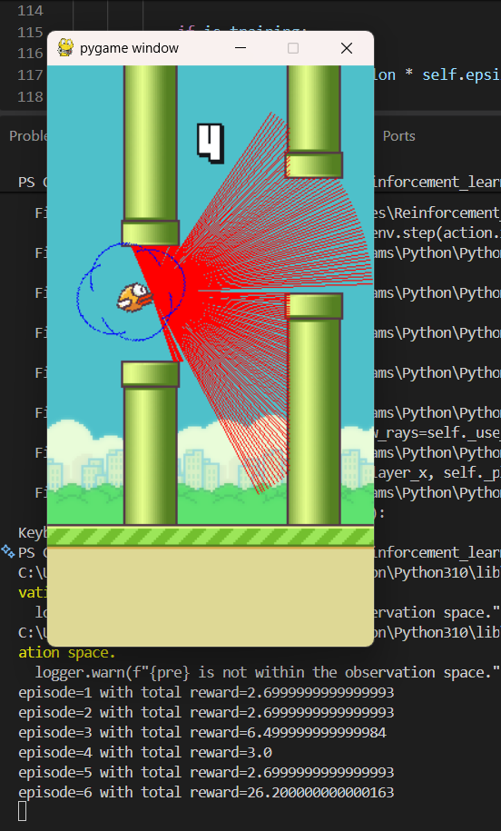

# 🐦 Flappy Bird RL — Deep Q-Learning Agent

A Reinforcement Learning project where a Deep Q-Network (DQN) learns to play Flappy Bird using PyTorch and Gymnasium.

The agent learns through states, actions, rewards, and experience replay rather than manually programmed gameplay rules.

## 🎮 Demo

### 🤖 Trained AI Gameplay



### 🎥 Gameplay Video

[▶ Watch the AI Gameplay Demo](assets/demo.mp4)

## 🧠 How It Works

```text
Flappy Bird Environment
          ↓
        State
          ↓
      Policy DQN
          ↓
   Action Selection
      ↙       ↘
 Explore     Exploit
      ↘       ↙
        Action
          ↓
     Environment
          ↓
   Reward + Next State
          ↓
    Experience Replay
          ↓
      Mini-Batch
          ↓
      DQN Update
          ↓
    Target Network
